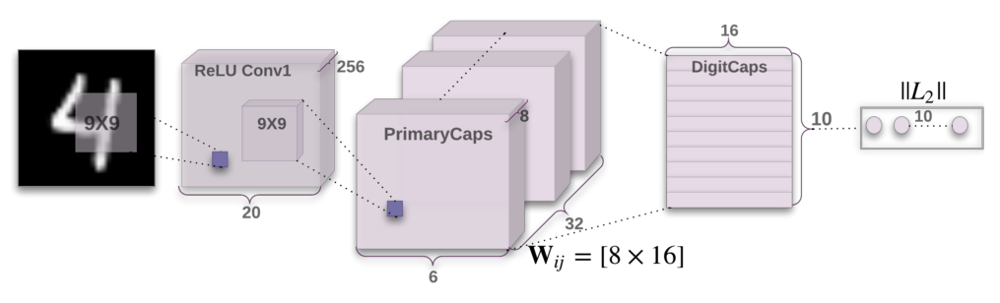

# CapsuleNet For MNIST
This is the keras implementation of image classification network based on the paper [Dynamic Routing Between Capsules.](https://arxiv.org/abs/1710.09829)
## Introduction
A capsule is a group of neurons whose activity vector represents the instantiation parameters of a specific type of entity such as an object or an object part. We use the length of the activity vector to represent the probability that the entity exists and its orientation to represent the instantiation parameters. Active capsules at one level make predictions, via transformation matrices, for the instantiation parameters of higher-level capsules. When multiple predictions agree, a higher level capsule becomes active. 


## Setup Instructions

1. Clone the repository.
```
git clone https://github.com/namish800/CapsuleNet.git
```
2. Make sure you have all the dependencies installed.

- Numpy

- Pandas

- Keras  

3. If not, then run the following command.
```
pip install -r requirements.txt
```
